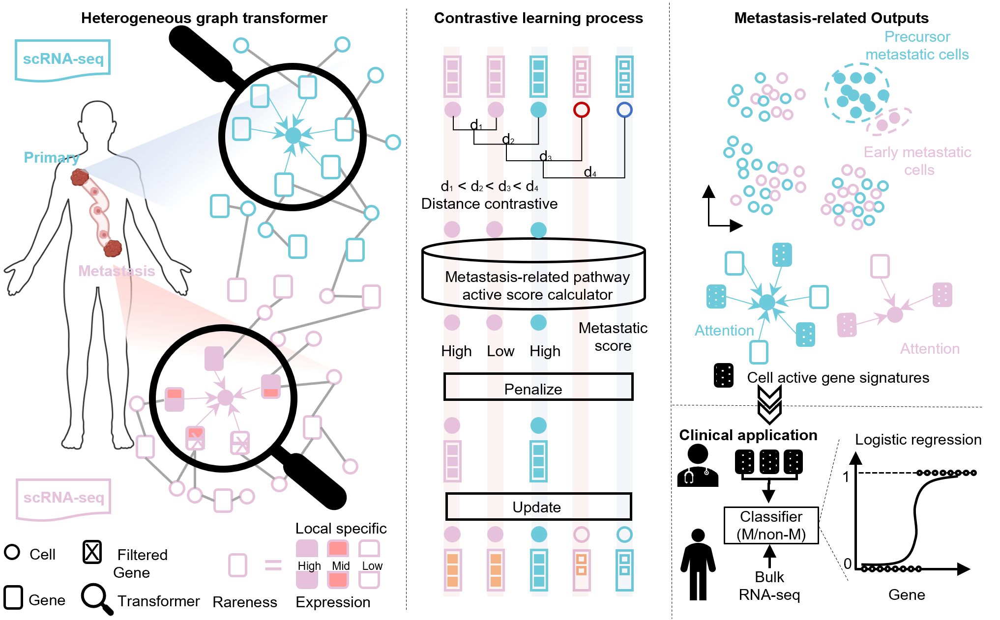

<h1 align="center">EmitGCL: Early Metastatic cell Identification Tool based on Graph Contrastive Learning</h1>

## Description

We developed EmitGCL, a graph contrastive learning model that integrates metastatic knowledge to detect subtle differences in cell groups at primary and metastatic sites. 

  

